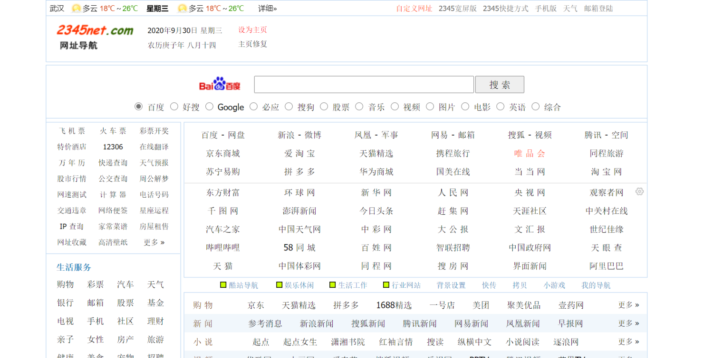

最近，我发现我一个大学成绩很好的朋友，不仅一直在用「百度」搜索，而且电脑主页甚至还是「2345网址导航」这种上个年代的浏览器主页。

当然，是我的错误观念先入为主了：我以为，成绩更优秀的人，应该懂得「搜索」对自己的影响有多大，并因此学会改善和优化自己的搜索体验。

但是，事实证明，我之前的想法是错误的。在百度一统国内江山的这些年，很多人除了百度以外，并不知道其他搜索引擎的存在。「百度一下」俨然已经成为了搜索的唯一代表。有时候，连我这个已经弃用百度4年的人，都会下意识地让别人去「百度一下」。

不仅如此，我的那位朋友，甚至分不清「浏览器」和「搜索引擎」的区别。我相信，这应该不是个例。

**在这篇文章里，我会告诉你为什么一个更好的搜索引擎那么重要，以及为何我们应该放弃百度、使用必应，并在最后给出一个简单的指引，让我们在手机、平板、电脑上都能获得最佳的搜索体验。**

# **重要性**

谨慎起见，我依然想前面提到的两个关键词做一个介绍。我们不妨把「搜索引擎」想象成一个「帮你找东西的机器人」，不同的机器人呈现给你的寻物结果，自然不同。

而「浏览器」，则是这个机器人的外壳。我们可以更换很多很多的外壳，就像很多人喜欢购买、更换手机壳一样。但是，换汤不换药，只要你使用的机器人还是同一个，那么在搜索结果上，浏览器就不会带来很大的差别。

当然，外壳与外壳之间，还是有很大差别的：有些外壳上贴满了小广告，有些外壳允许自定义装饰，有些外壳简约、大气、舒适，不一而足。

话题收回，让我们继续。常见的搜索引擎，主要有百度、必应、谷歌、搜狗、雅虎、360……真正值得提及的，只有前三个。但是由于特殊原因，最好用的谷歌搜索在大陆地区无法访问。

**因此，留给我们、用以替代百度的最佳选择，只剩下由微软公司提供的「必应」搜索了。**

空口无凭，不妨通过对比来进一步了解。

**我必须指出：请不要再轻视你用的搜索引擎了！**

对不熟悉、不了解、有困惑的人、事、物，在网上搜索，是我们再熟悉不过的行为了。大家不妨翻一下自己过去一周的搜索记录，看看自己到底对互联网世界提出了多少问题。

我们已经离不开网络搜索了。当一个东西成为我们最常用的事物时，我们就应该开始关心它的质量了。难道我们会用一个粗糙的草团，当作每晚睡觉用的枕头吗？

如果你的答案是否定的，那我们就应该给予搜索引擎以同样的重视。

不仅如此，这其中还有一个「不忘初心」的问题。当「上网搜索」以其便捷性和快速性，全面代替字典、百科全书等更专业的检索方式时，我们不应该抛弃「初心」——对搜索结果的专业性要求。当年对新华字典查询结果毫无保留的信任，你还记得吗？

**别忘了，搜得快不是我们的目的，准确、有效、靠谱才是我们进行一次搜索，想要获得的体验。**

而这正是百度应该被批评的最致命缺点——搜出来的结果鱼龙混杂、难以分辨。

迎面走来的是一次书籍搜索结果的对比。按下搜索键后，百度呈现的前两条结果都是广告——这占据了手机几乎80%的版面。而必应提供的页面里，最专业、重要的结果——百科、豆瓣、知乎——正好在前三条，没有一条是广告内容。

接下来，让我们再看看肚子饿想做饭时的搜索结果。百度提供的前两条依然是广告内容（大众点评、小视频聚合），直到看不见的第三条才是百度百科。而必应提供的依然是相对专业的内容，百科、美食中国、美食天下。

其次是对一些英文内容的搜索结果。这是一本英文书籍，百度提供的前三条中，第二条的结果比较靠谱，但是最重要的首条和第三条依然不够准确。而相比较而言，必应的搜索结果十分精确，第一条是这本书的英文官方网站，第二条是豆瓣。

值得一提的是，必应毕竟是由美国的微软公司提供的，英文搜索结果肯定比百度要准确不少。

不仅如此，我还想给大家呈现一下搜索首页。百度首页充斥着无关的广告和资讯，右上角、搜索框下，都是广告。而广告之下则是一大堆新闻——一大堆让我们分神的内容。很有可能，当我们打开浏览器10分钟后，才突然一拍脑袋——诶，我刚刚搜什么来着？

相比之下，必应的搜索首页非常大气。背景是每日更新的图片，而且没有任何广告和资讯，让我们能够直接专注于搜索本身。

不仅如此，有时候用着用着，百度就会弹一个「臭不要脸」的窗口出来——快来下载臣妾吧！相比之下，必应自始至终都不会有这种「突脸」行为。

篇幅有限，无法详尽列举。如果还有兴趣多了解一点「百度搜索」的无耻之处的同学，请移步知乎问题`为什么很多人都说百度是家缺德的公司？`

# **实操**

了解搜索对我们自己有多重要是第一步，「弃暗投明」才是更重要的一步。

对于iPhone、iPad、Mac用户，设置非常简单。只需要进行如下更改即可：`设置→Safari浏览器→搜索引擎→必应`。

对于安卓手机用户，浏览器的选择则非常重要。很多国内浏览器只支持使用国内的搜索引擎，而非百度的国内搜索引擎也不过半斤八两罢了。我推荐使用`夸克浏览器、神奇浏览器、Via浏览器`。这三个浏览器都可以在设置中进行更改，将搜索引擎改成必应。

对于WIndows电脑用户，浏览器的选择依然重要。`Chrome和Edge浏览器`都是最佳选择。我们同样可以在这两个浏览器的设置里找到搜索引擎，并且修改为必应。
